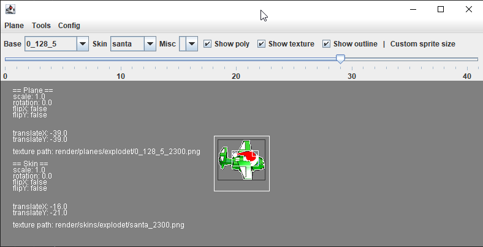
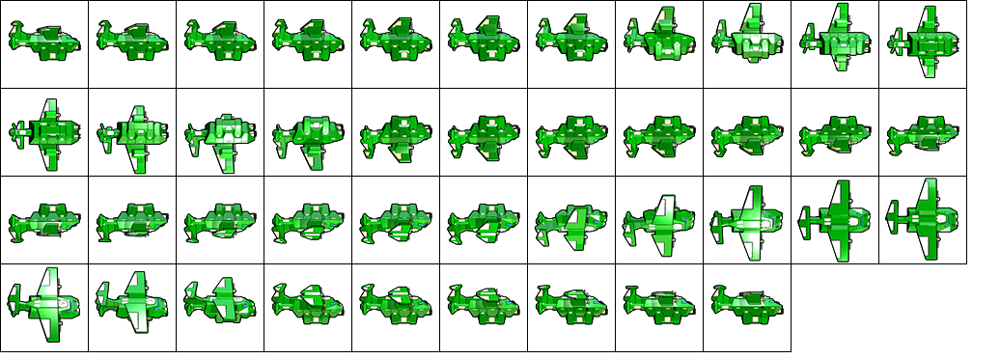
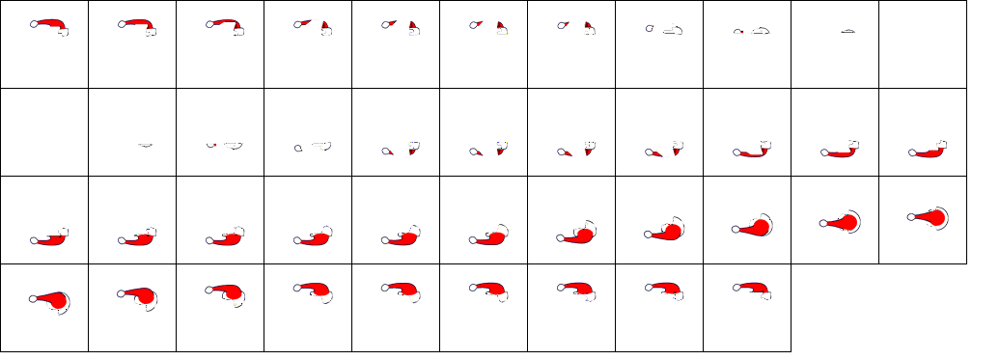
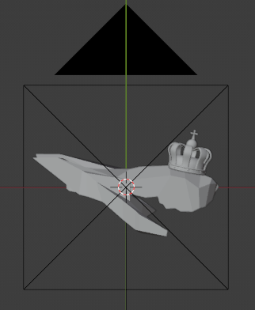

# AltiSkinTool

A GUI interface and Blender project to aid the viewing and creation of [Altitude](https://store.steampowered.com/app/41300/Altitude/) video game's sprite sheets.

## Features

### View Plane/Skin packs

After pointing the program to the Altitude's 'dist' folder via 'Config > Set dist Path' the program will unpack and allow you to view plane and skin image files along with associated polygon and outline.

### Sprite Sheets

The application can generate sprite sheets, load them, and pack them back into the game readable format.

Tools > Plane Sprite Sheet

Tools > Skin Sprite Sheet

### Blender Project 'sprite_render.blend'

A blender project setup with rudimentary 3d models of each of the 5 planes generated using **shadow carving** techniques.

In the game planes are rendered using 2 separate sprite sheets. One for the plane and one for the skin such as the Santa Hat you can see in the **Sprite Sheets** section.

Every model in the project comes with a camera/keyframe configuration corresponding to the number of frames and rotations used by the game to represent each of the planes, as well as a script to apply these rotations to any object added to the scene (e.g. the crown in the image above). When rendered the project will produce 500x500 frames that can then be converted into a sprite sheet and fed into the app.

The plane models are used to apply a transparent mask on any other objects in the scene which is useful when producing skins as in-game these are rendered on top of the planes.

## Showcase
